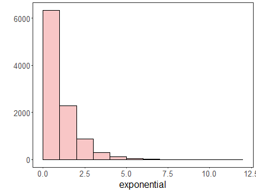
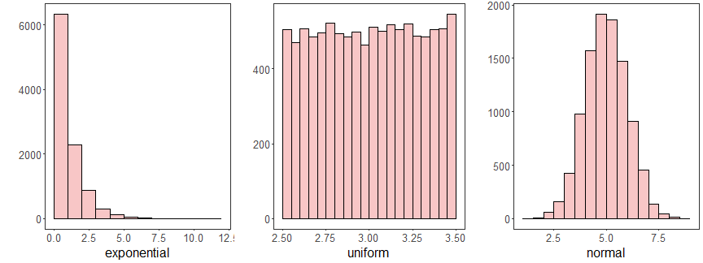
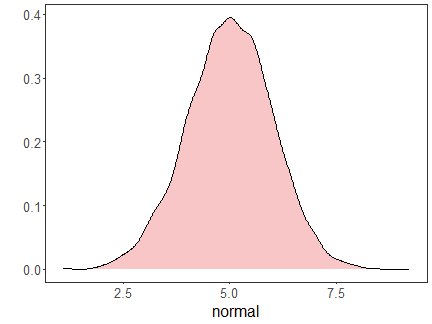
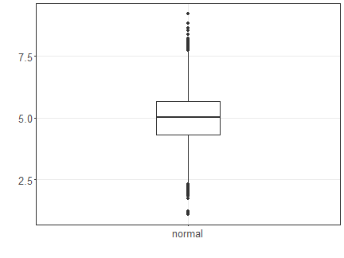

#### Plotting charts


``` r
# The easiest way to get ggplot2 is to install the whole tidyverse
#install.packages("tidyverse")
#install.packages("ggplot2")
```


#### ggplot easy encapsulation through daltoolbox


``` r
library(daltoolbox)
library(ggplot2)
```

#### Color Brewer R Package


``` r
#install.packages("RColorBrewer")
library(RColorBrewer)
colors <- brewer.pal(4, 'Set1')
```


#### Basic setup for examples

Iris datasets


``` r
head(iris, 3)
```

```
##   Sepal.Length Sepal.Width Petal.Length Petal.Width Species
## 1          5.1         3.5          1.4         0.2  setosa
## 2          4.9         3.0          1.4         0.2  setosa
## 3          4.7         3.2          1.3         0.2  setosa
```

Options from graphics: colors and font size


``` r
colors <- brewer.pal(4, 'Set1')
font <- theme(text = element_text(size=16))
```

#### Scatter plot


``` r
data <- data.frame(
  x = iris$Sepal.Length,
  value = iris$Sepal.Width,
  variable = iris$Species
)
#head(data)
grf <- plot_scatter(data, label_x = "Sepal.Length", label_y = "Sepal.Width", colors=colors[1:3]) + font
plot(grf)
```


#### Bar plot


``` r
agg <- aggregation("Species", Sepal.Length = mean(Sepal.Length))
data <- transform(agg, iris)
#head(data)
grf <- plot_bar(data, colors=colors[1:3]) + font
plot(grf)
```


#### Lollipop plot


``` r
agg <- aggregation("Species", Sepal.Length = mean(Sepal.Length))
data <- transform(agg, iris)
#head(data)
grf <- plot_lollipop(data, colors=colors[1], max_value_gap=0.2) + font + coord_flip() 
plot(grf)
```


#### Bar graph with error


``` r
agg <- aggregation("Species", mean = mean(Sepal.Length), sd = sd(Sepal.Length))
data <- transform(agg, iris)
#head(data)
grf <- plot_bar(data, colors=colors[1], alpha=1) + font
grf <- grf + geom_errorbar(data = data, inherit.aes = FALSE,
                           aes(x=Species, ymin=mean-sd, ymax=mean+sd), 
                           width=0.2, colour="darkred", alpha=0.8, size=1.1) 
plot(grf)
```


#### Pie plot


``` r
agg <- aggregation("Species", n = n())
data <- transform(agg, iris)
#head(data)
grf <- plot_pieplot(data, colors=colors[1:3]) + font
plot(grf)
```


#### Grouped bar


``` r
agg <- aggregation("Species",
  Sepal.Length = mean(Sepal.Length),
  Sepal.Width = mean(Sepal.Width)
)
data <- transform(agg, iris)

#head(data)
grf <- plot_groupedbar(data, colors=colors[1:2]) + font
plot(grf)
```


#### Stacked-bar


``` r
agg <- aggregation("Species",
  Sepal.Length = mean(Sepal.Length),
  Sepal.Width = mean(Sepal.Width)
)
data <- transform(agg, iris)

#head(data)
grf <- plot_stackedbar(data, colors=colors[1:2]) + font
grf <- grf + theme(axis.text.x = element_text(angle=90, hjust=1))
plot(grf)
```


#### Line chart


``` r
x <- seq(0, 10, 0.25)
serie <- data.frame(x, y=sin(x))

#head(serie)
grf <- plot_series(serie, colors=colors[1]) + font
plot(grf)
```


#### Data distribution example


``` r
example <- data.frame(exponential = rexp(10000, rate = 1),
                      uniform = runif(10000, min=2.5, max = 3.5),
                      normal = rnorm(10000, mean = 5))
head(example)
```

```
##   exponential  uniform   normal
## 1  0.05967559 2.701075 4.602639
## 2  0.18027672 3.088975 4.848505
## 3  2.62771794 3.064656 5.075857
## 4  1.01348566 2.882878 4.436191
## 5  0.68860668 2.891280 4.479946
## 6  0.42987097 2.766601 2.263351
```


#### Histogram


``` r
data <- data.frame(exponential = example$exponential)
#head(data)
grf <- plot_hist(data, label_x = "exponential", color=colors[1]) + font
plot(grf) 
```




#### Multiple Histograms


``` r
{
library(gridExtra)  
grfe <- plot_hist(data.frame(exponential = example$exponential), label_x = "exponential", color=colors[1]) + font
grfu <- plot_hist(data.frame(uniform = example$uniform), label_x = "uniform", color=colors[1]) + font 
grfn <- plot_hist(data.frame(normal = example$normal), label_x = "normal", color=colors[1]) + font
grid.arrange(grfe, grfu, grfn, ncol=3)
}
```



#### Density plot


``` r
data <- data.frame(normal = example$normal)
#head(data)
grf <- plot_density(data, label_x = "normal", color=colors[1]) + font
plot(grf) 
```



#### Box plot


``` r
data <- data.frame(normal = example$normal)
#head(data)
grf <- plot_boxplot(data, colors="white") + font
plot(grf) 
```



