# Análise Exploratória de Dados (EDA)

Este roteiro apresenta exemplos práticos alinhados aos slides de `2-AnaliseExploratoria.pdf`.  
Cada chunk inclui um comentário com o **número do slide** correspondente.

## Configuração


``` r
# Slides 1–3: contexto e objetivos da EDA
require_pkg <- function(pkg) {
  if (!requireNamespace(pkg, quietly = TRUE)) {
    stop(sprintf("Pacote '%s' não instalado. Instale com install.packages('%s').", pkg, pkg))
  }
  invisible(TRUE)
}

pkgs <- c(
  "daltoolbox",
  "RColorBrewer",
  "ggplot2",
  "GGally",
  "dplyr",
  "tidyr",
  "scales",
  "gridExtra",
  "aplpack"
)
invisible(lapply(pkgs, require_pkg))

suppressPackageStartupMessages({
  library(daltoolbox)
  library(RColorBrewer)
  library(ggplot2)
  library(GGally)
  library(dplyr)
  library(tidyr)
  library(scales)
  library(gridExtra)
  library(aplpack)
})

colors <- brewer.pal(4, "Set1")
font <- theme(text = element_text(size = 16))
```


``` r
# Slide 31: correlograma
plot_correlation <- function(df,
                             vars = NULL,
                             method = c("pearson", "spearman", "kendall"),
                             use = "pairwise.complete.obs",
                             triangle = c("full", "upper", "lower"),
                             reorder = c("none", "hclust", "alphabetical"),
                             digits = 2,
                             label_size = 3,
                             tile_color = "white",
                             show_diag = TRUE,
                             title = NULL) {
  method   <- match.arg(method)
  triangle <- match.arg(triangle)
  reorder  <- match.arg(reorder)

  if (!is.null(vars)) {
    if (!all(vars %in% names(df))) {
      bad <- vars[!vars %in% names(df)]
      stop("Vars ausentes: ", paste(bad, collapse = ", "))
    }
    df2 <- df[, vars, drop = FALSE]
  } else {
    df2 <- df[, vapply(df, is.numeric, logical(1)), drop = FALSE]
  }

  if (ncol(df2) < 2) stop("Precisa de ao menos 2 colunas numéricas.")

  corr <- stats::cor(df2, use = use, method = method)

  if (reorder == "alphabetical") {
    ord <- order(colnames(corr))
    corr <- corr[ord, ord, drop = FALSE]
  } else if (reorder == "hclust") {
    d <- stats::as.dist(1 - corr)
    ord <- stats::hclust(d, method = "complete")$order
    corr <- corr[ord, ord, drop = FALSE]
  }

  corr_long <- as.data.frame(corr) |>
    tibble::rownames_to_column("Var1") |>
    tidyr::pivot_longer(-Var1, names_to = "Var2", values_to = "value") |>
    dplyr::mutate(
      Var1 = factor(Var1, levels = rownames(corr)),
      Var2 = factor(Var2, levels = colnames(corr))
    ) |>
    dplyr::mutate(i = as.integer(Var1), j = as.integer(Var2))

  if (triangle == "upper") {
    corr_long <- corr_long |>
      dplyr::filter(j > i | (show_diag & j == i))
  } else if (triangle == "lower") {
    corr_long <- corr_long |>
      dplyr::filter(i > j | (show_diag & j == i))
  } else {
    if (!show_diag) corr_long <- corr_long |>
      dplyr::filter(i != j)
  }

  corr_long <- corr_long |>
    dplyr::mutate(label = dplyr::if_else(is.na(value), "", format(round(value, digits), nsmall = digits)))

  ggplot2::ggplot(corr_long, ggplot2::aes(x = Var1, y = Var2, fill = value)) +
    ggplot2::geom_tile(color = tile_color, linewidth = 0.3) +
    ggplot2::geom_text(ggplot2::aes(label = label), size = label_size) +
    ggplot2::scale_fill_gradient2(
      low = "#4575b4",
      mid = "white",
      high = "#d73027",
      midpoint = 0,
      limits = c(-1, 1),
      oob = scales::squish,
      name = paste0("Corr (", method, ")")
    ) +
    ggplot2::coord_fixed() +
    ggplot2::labs(title = title, x = NULL, y = NULL) +
    ggplot2::theme_minimal(base_size = 12) +
    ggplot2::theme(
      panel.grid = ggplot2::element_blank(),
      axis.text.x = ggplot2::element_text(angle = 45, hjust = 1),
      plot.title = ggplot2::element_text(face = "bold")
    )
}

plot_pair <- function(data, cnames, title = NULL, clabel = NULL, colors) {
  icol <- match(cnames, colnames(data))
  icol <- icol[!is.na(icol)]
  if (!is.null(clabel)) {
    grf <- ggpairs(data, columns = icol, aes(colour = .data[[clabel]], alpha = 0.4)) +
      theme_bw(base_size = 10) +
      scale_color_manual(values = colors)
  } else {
    grf <- ggpairs(data, columns = icol) + theme_bw(base_size = 10)
  }
  if (!is.null(title)) grf <- grf + ggtitle(title)
  grf
}

plot_pair_adv <- function(data, cnames, title = NULL, clabel = NULL, colors) {
  if (!is.null(clabel)) {
    data$clabel <- data[, clabel]
    cnames <- c(cnames, "clabel")
  }
  icol <- match(cnames, colnames(data))
  icol <- icol[!is.na(icol)]

  if (!is.null(clabel)) {
    grf <- ggpairs(data, columns = icol, aes(colour = clabel, alpha = 0.4)) + theme_bw(base_size = 10)
    for (i in 1:grf$nrow) {
      for (j in 1:grf$ncol) {
        grf[i, j] <- grf[i, j] + scale_fill_manual(values = colors) + scale_color_manual(values = colors)
      }
    }
  } else {
    grf <- ggpairs(data, columns = icol) + theme_bw(base_size = 10)
  }
  if (!is.null(title)) grf <- grf + ggtitle(title)
  grf
}
```

## Dataset Iris


``` r
# Slide 11: O Dataset Iris
head(iris[c(1:2, 51:52, 101:102), ])
```

```
##     Sepal.Length Sepal.Width Petal.Length Petal.Width    Species
## 1            5.1         3.5          1.4         0.2     setosa
## 2            4.9         3.0          1.4         0.2     setosa
## 51           7.0         3.2          4.7         1.4 versicolor
## 52           6.4         3.2          4.5         1.5 versicolor
## 101          6.3         3.3          6.0         2.5  virginica
## 102          5.8         2.7          5.1         1.9  virginica
```

## Estatísticas descritivas


``` r
# Slides 12–13: medidas descritivas básicas
sum <- summary(iris$Sepal.Length)
sum
```

```
##    Min. 1st Qu.  Median    Mean 3rd Qu.    Max. 
##   4.300   5.100   5.800   5.843   6.400   7.900
```


``` r
# Slide 14: quartis e IQR
IQR <- sum["3rd Qu."] - sum["1st Qu."]
IQR
```

```
## 3rd Qu. 
##     1.3
```

## Histogramas e densidades


``` r
# Slide 18: histograma
grf <- plot_hist(iris |> dplyr::select(Sepal.Length),
                 label_x = "Sepal Length", color = colors[1]) + font
```

```
## Using  as id variables
```

``` r
plot(grf)
```

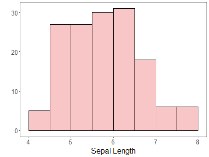


``` r
# Slides 16–17: histogramas agrupados
grf1 <- plot_hist(iris |> dplyr::select(Sepal.Length),
                  label_x = "Sepal.Length", color = colors[1]) + font
```

```
## Using  as id variables
```

``` r
grf2 <- plot_hist(iris |> dplyr::select(Sepal.Width),
                  label_x = "Sepal.Width", color = colors[1]) + font
```

```
## Using  as id variables
```

``` r
grf3 <- plot_hist(iris |> dplyr::select(Petal.Length),
                  label_x = "Petal.Length", color = colors[1]) + font
```

```
## Using  as id variables
```

``` r
grf4 <- plot_hist(iris |> dplyr::select(Petal.Width),
                  label_x = "Petal.Width", color = colors[1]) + font
```

```
## Using  as id variables
```

``` r
grid.arrange(grf1, grf2, grf3, grf4, ncol = 2)
```

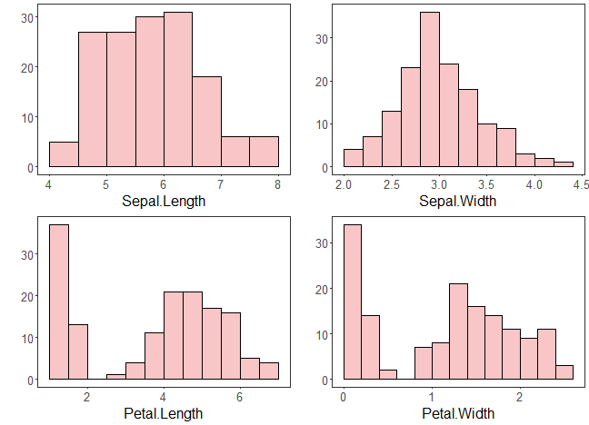


``` r
# Slide 17: densidade
grf1 <- plot_density(iris |> dplyr::select(Sepal.Length),
                     label_x = "Sepal.Length", color = colors[1]) + font
```

```
## Using  as id variables
```

``` r
grf2 <- plot_density(iris |> dplyr::select(Sepal.Width),
                     label_x = "Sepal.Width", color = colors[1]) + font
```

```
## Using  as id variables
```

``` r
grf3 <- plot_density(iris |> dplyr::select(Petal.Length),
                     label_x = "Petal.Length", color = colors[1]) + font
```

```
## Using  as id variables
```

``` r
grf4 <- plot_density(iris |> dplyr::select(Petal.Width),
                     label_x = "Petal.Width", color = colors[1]) + font
```

```
## Using  as id variables
```

``` r
grid.arrange(grf1, grf2, grf3, grf4, ncol = 2)
```

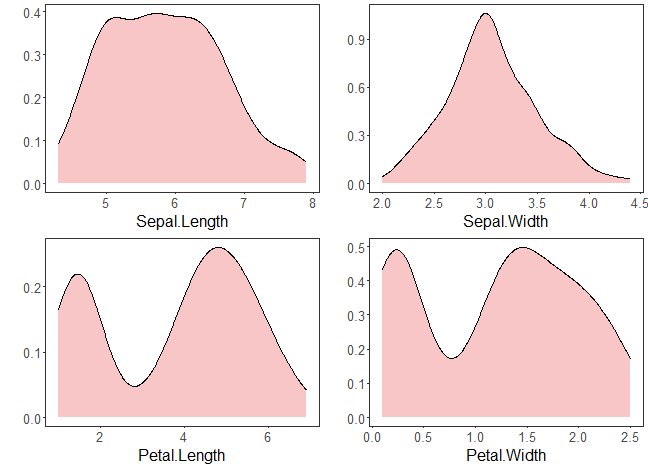

## Boxplots


``` r
# Slide 24: boxplot do Iris
grf <- plot_boxplot(iris, colors = colors[1]) + font
```

```
## Using Species as id variables
```

``` r
plot(grf)
```

```
## Ignoring unknown labels:
## • colour : "c(\"Sepal.Length\", \"Sepal.Width\", \"Petal.Length\", \"Petal.Width\", \"Species\")"
```

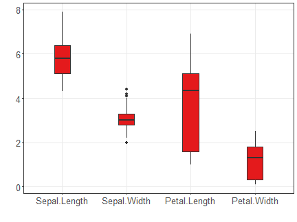

## Comparação por classe


``` r
# Slide 25: densidade com rótulo de classe
grfA <- plot_density_class(iris |> dplyr::select(Species, Sepal.Length),
                           class_label = "Species", label_x = "Sepal.Length", color = colors[c(1:3)]) + font
grfB <- plot_density_class(iris |> dplyr::select(Species, Sepal.Width),
                           class_label = "Species", label_x = "Sepal.Width", color = colors[c(1:3)]) + font
grfC <- plot_density_class(iris |> dplyr::select(Species, Petal.Length),
                           class_label = "Species", label_x = "Petal.Length", color = colors[c(1:3)]) + font
grfD <- plot_density_class(iris |> dplyr::select(Species, Petal.Width),
                           class_label = "Species", label_x = "Petal.Width", color = colors[c(1:3)]) + font
grid.arrange(grfA, grfB, grfC, grfD, ncol = 2, nrow = 2)
```

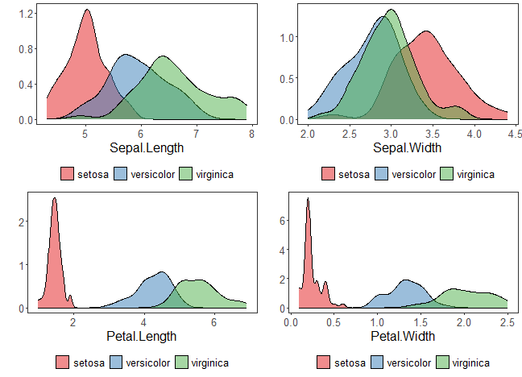


``` r
# Slide 26: boxplot com rótulo de classe
grfA <- plot_boxplot_class(iris |> dplyr::select(Species, Sepal.Length),
                           class_label = "Species", label_x = "Sepal.Length", color = colors[c(1:3)]) + font
grfB <- plot_boxplot_class(iris |> dplyr::select(Species, Sepal.Width),
                           class_label = "Species", label_x = "Sepal.Width", color = colors[c(1:3)]) + font
grfC <- plot_boxplot_class(iris |> dplyr::select(Species, Petal.Length),
                           class_label = "Species", label_x = "Petal.Length", color = colors[c(1:3)]) + font
grfD <- plot_boxplot_class(iris |> dplyr::select(Species, Petal.Width),
                           class_label = "Species", label_x = "Petal.Width", color = colors[c(1:3)]) + font
grid.arrange(grfA, grfB, grfC, grfD, ncol = 2, nrow = 2)
```

```
## Ignoring unknown labels:
## • colour : "c(\"setosa\", \"versicolor\", \"virginica\")"
## Ignoring unknown labels:
## • colour : "c(\"setosa\", \"versicolor\", \"virginica\")"
## Ignoring unknown labels:
## • colour : "c(\"setosa\", \"versicolor\", \"virginica\")"
## Ignoring unknown labels:
## • colour : "c(\"setosa\", \"versicolor\", \"virginica\")"
```

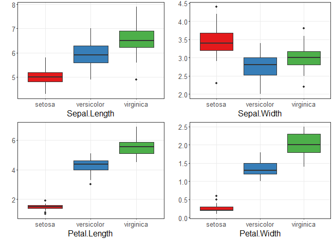

## Scatter plots


``` r
# Slide 28: scatter plot
grf <- plot_scatter(iris |> dplyr::select(x = Sepal.Length, value = Sepal.Width) |> mutate(variable = "iris"),
                    label_x = "Sepal.Length") +
  theme(legend.position = "none") + font
plot(grf)
```

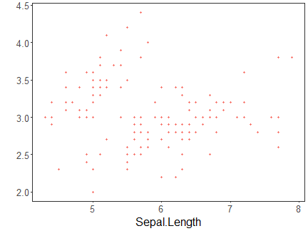


``` r
# Slide 29: scatter plot com classe
grf <- plot_scatter(iris |> dplyr::select(x = Sepal.Length, value = Sepal.Width, variable = Species),
                    label_x = "Sepal.Length", label_y = "Sepal.Width", colors = colors[1:3]) + font
plot(grf)
```

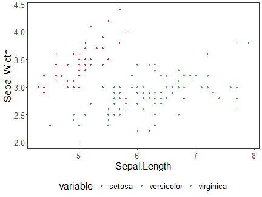

## Correlação e matrizes


``` r
# Slide 31: correlograma
grf <- plot_correlation(iris |> dplyr::select(Sepal.Width, Sepal.Length, Petal.Width, Petal.Length))
grf
```

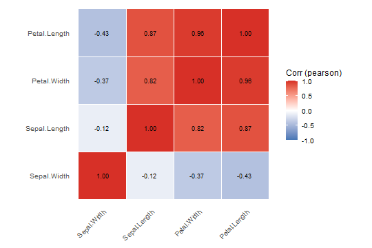


``` r
# Slide 32: matriz de dispersão
grf <- plot_pair(data = iris, cnames = colnames(iris)[1:4], title = "Iris", colors = colors[1])
print(grf)
```

```
## plot: [1, 1] [======>----------------------------------------------------------------------------------------------------------] 6% est: 0s
## plot: [1, 2] [=============>---------------------------------------------------------------------------------------------------] 12% est: 1s
## plot: [1, 3] [====================>--------------------------------------------------------------------------------------------] 19% est: 1s
## plot: [1, 4] [===========================>-------------------------------------------------------------------------------------] 25% est: 1s
## plot: [2, 1] [==================================>------------------------------------------------------------------------------] 31% est: 1s
## plot: [2, 2] [=========================================>-----------------------------------------------------------------------] 38% est: 1s
## plot: [2, 3] [================================================>----------------------------------------------------------------] 44% est: 1s
## plot: [2, 4] [=======================================================>---------------------------------------------------------] 50% est: 1s
## plot: [3, 1] [===============================================================>-------------------------------------------------] 56% est: 1s
## plot: [3, 2] [======================================================================>------------------------------------------] 62% est: 0s
## plot: [3, 3] [=============================================================================>-----------------------------------] 69% est: 0s
## plot: [3, 4] [====================================================================================>----------------------------] 75% est: 0s
## plot: [4, 1] [===========================================================================================>---------------------] 81% est: 0s
## plot: [4, 2] [==================================================================================================>--------------] 88% est: 0s
## plot: [4, 3] [=========================================================================================================>-------] 94% est: 0s
## plot: [4, 4] [=================================================================================================================]100% est: 0s
```

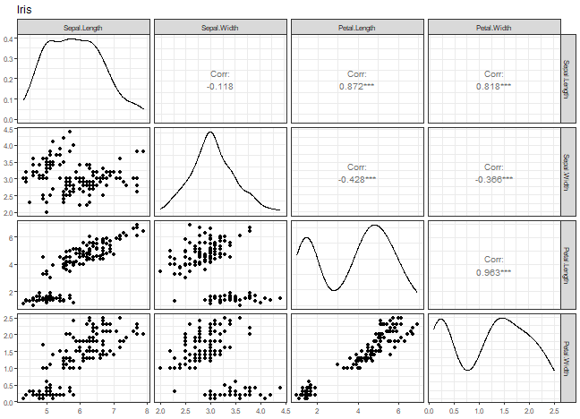


``` r
# Slide 33: matriz de dispersão com classe
grf <- plot_pair(data = iris, cnames = colnames(iris)[1:4], clabel = "Species", title = "Iris", colors = colors[1:3])
print(grf)
```

```
## plot: [1, 1] [======>----------------------------------------------------------------------------------------------------------] 6% est: 0s
## plot: [1, 2] [=============>---------------------------------------------------------------------------------------------------] 12% est: 1s
## plot: [1, 3] [====================>--------------------------------------------------------------------------------------------] 19% est: 1s
## plot: [1, 4] [===========================>-------------------------------------------------------------------------------------] 25% est: 1s
## plot: [2, 1] [==================================>------------------------------------------------------------------------------] 31% est: 1s
## plot: [2, 2] [=========================================>-----------------------------------------------------------------------] 38% est: 1s
## plot: [2, 3] [================================================>----------------------------------------------------------------] 44% est: 1s
## plot: [2, 4] [=======================================================>---------------------------------------------------------] 50% est: 1s
## plot: [3, 1] [===============================================================>-------------------------------------------------] 56% est: 1s
## plot: [3, 2] [======================================================================>------------------------------------------] 62% est: 1s
## plot: [3, 3] [=============================================================================>-----------------------------------] 69% est: 1s
## plot: [3, 4] [====================================================================================>----------------------------] 75% est: 1s
## plot: [4, 1] [===========================================================================================>---------------------] 81% est: 0s
## plot: [4, 2] [==================================================================================================>--------------] 88% est: 0s
## plot: [4, 3] [=========================================================================================================>-------] 94% est: 0s
## plot: [4, 4] [=================================================================================================================]100% est: 0s
```

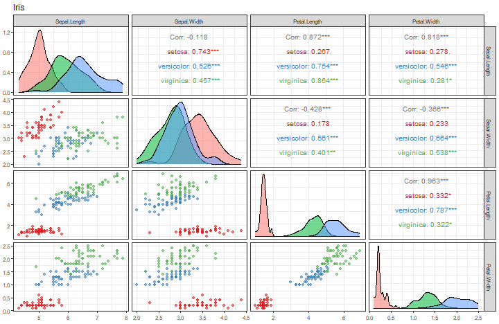


``` r
# Slide 34: matriz de dispersão avançada
grf <- plot_pair_adv(data = iris, cnames = colnames(iris)[1:4], title = "Iris", colors = colors[1])
grf
```

```
## plot: [1, 1] [======>----------------------------------------------------------------------------------------------------------] 6% est: 0s
## plot: [1, 2] [=============>---------------------------------------------------------------------------------------------------] 12% est: 1s
## plot: [1, 3] [====================>--------------------------------------------------------------------------------------------] 19% est: 1s
## plot: [1, 4] [===========================>-------------------------------------------------------------------------------------] 25% est: 1s
## plot: [2, 1] [==================================>------------------------------------------------------------------------------] 31% est: 1s
## plot: [2, 2] [=========================================>-----------------------------------------------------------------------] 38% est: 1s
## plot: [2, 3] [================================================>----------------------------------------------------------------] 44% est: 1s
## plot: [2, 4] [=======================================================>---------------------------------------------------------] 50% est: 1s
## plot: [3, 1] [===============================================================>-------------------------------------------------] 56% est: 1s
## plot: [3, 2] [======================================================================>------------------------------------------] 62% est: 1s
## plot: [3, 3] [=============================================================================>-----------------------------------] 69% est: 0s
## plot: [3, 4] [====================================================================================>----------------------------] 75% est: 0s
## plot: [4, 1] [===========================================================================================>---------------------] 81% est: 0s
## plot: [4, 2] [==================================================================================================>--------------] 88% est: 0s
## plot: [4, 3] [=========================================================================================================>-------] 94% est: 0s
## plot: [4, 4] [=================================================================================================================]100% est: 0s
```


``` r
# Slide 35: matriz de dispersão avançada com classe
grf <- plot_pair_adv(data = iris, cnames = colnames(iris)[1:4], title = "Iris", clabel = "Species", colors = colors[1:3])
grf
```

```
## plot: [1, 1] [====>------------------------------------------------------------------------------------------------------------] 4% est: 0s
## plot: [1, 2] [========>--------------------------------------------------------------------------------------------------------] 8% est: 2s
## plot: [1, 3] [=============>---------------------------------------------------------------------------------------------------] 12% est: 2s
## plot: [1, 4] [=================>-----------------------------------------------------------------------------------------------] 16% est: 3s
## plot: [1, 5] [======================>------------------------------------------------------------------------------------------] 20% est: 3s
## plot: [2, 1] [==========================>--------------------------------------------------------------------------------------] 24% est: 3s
## plot: [2, 2] [===============================>---------------------------------------------------------------------------------] 28% est: 3s
## plot: [2, 3] [===================================>-----------------------------------------------------------------------------] 32% est: 3s
## plot: [2, 4] [========================================>------------------------------------------------------------------------] 36% est: 3s
## plot: [2, 5] [============================================>--------------------------------------------------------------------] 40% est: 3s
## plot: [3, 1] [=================================================>---------------------------------------------------------------] 44% est: 3s
## plot: [3, 2] [=====================================================>-----------------------------------------------------------] 48% est: 2s
## plot: [3, 3] [==========================================================>------------------------------------------------------] 52% est: 2s
## plot: [3, 4] [==============================================================>--------------------------------------------------] 56% est: 2s
## plot: [3, 5] [===================================================================>---------------------------------------------] 60% est: 2s
## plot: [4, 1] [=======================================================================>-----------------------------------------] 64% est: 2s
## plot: [4, 2] [============================================================================>------------------------------------] 68% est: 1s
## plot: [4, 3] [================================================================================>--------------------------------] 72% est: 1s
## plot: [4, 4] [=====================================================================================>---------------------------] 76% est: 1s
## plot: [4, 5] [=========================================================================================>-----------------------] 80% est: 1s
## plot: [5, 1] [==============================================================================================>------------------] 84% est: 1s
## `stat_bin()` using `bins = 30`. Pick better value `binwidth`.
 plot: [5, 2]
## [==================================================================================================>--------------] 88% est: 1s `stat_bin()`
## using `bins = 30`. Pick better value `binwidth`.
 plot: [5, 3]
## [=======================================================================================================>---------] 92% est: 1s `stat_bin()`
## using `bins = 30`. Pick better value `binwidth`.
 plot: [5, 4]
## [===========================================================================================================>-----] 96% est: 0s `stat_bin()`
## using `bins = 30`. Pick better value `binwidth`.
 plot: [5, 5]
## [=================================================================================================================]100% est: 0s
```

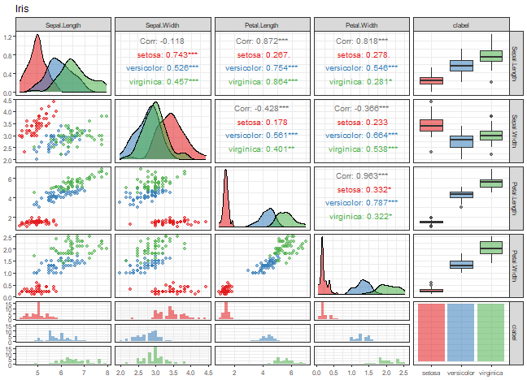

## Outras visualizações multivariadas


``` r
# Slide 37: coordenadas paralelas
grf <- ggparcoord(data = iris, columns = c(1:4), group = 5) +
  theme_bw(base_size = 10) + scale_color_manual(values = colors[1:3]) + font
plot(grf)
```

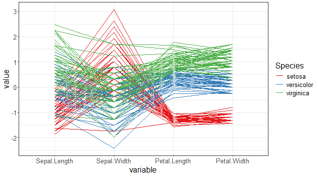


``` r
# Slide 38: visualização orientada a pixels
mat <- as.matrix(iris[, 1:4])
x <- (1:nrow(mat))
y <- (1:ncol(mat))
image(x, y, mat, col = brewer.pal(11, "Spectral"), axes = FALSE,
      main = "Iris", xlab = "sample", ylab = "Attributes")
axis(2, at = seq(0, ncol(mat), by = 1))
axis(1, at = seq(0, nrow(mat), by = 10))
```

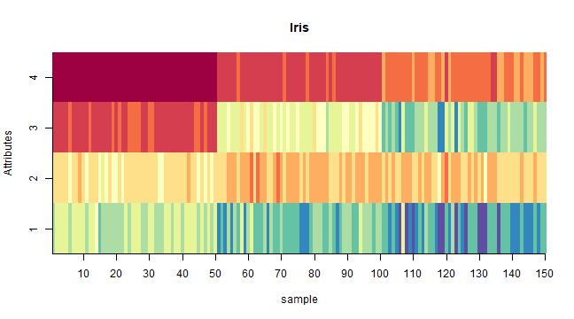


``` r
# Slides 40–41: Chernoff faces
set.seed(1)
sample_rows <- sample(1:nrow(iris), 25)
isample <- iris[sample_rows,]
labels <- as.character(rownames(isample))
isample$Species <- NULL
faces(isample, labels = labels, print.info = FALSE, cex = 1)
```

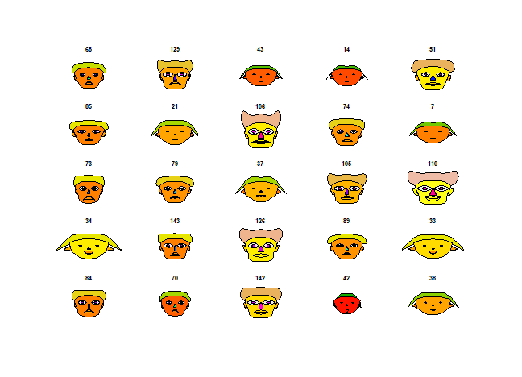


``` r
# Slide 42: Chernoff faces com classe
set.seed(1)
sample_rows <- sample(1:nrow(iris), 25)
isample <- iris[sample_rows,]
labels <- as.character(isample$Species)
isample$Species <- NULL
faces(isample, labels = labels, print.info = FALSE, cex = 1)
```

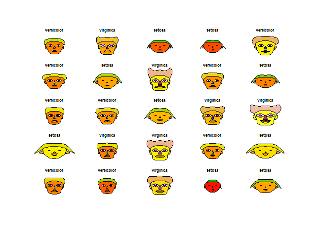

## Referências
- Tukey, J. W. (1977). *Exploratory Data Analysis*. Addison-Wesley.
- Cleveland, W. S. (1993). *Visualizing Data*. Hobart Press.
- Wickham, H. (2016). *ggplot2: Elegant Graphics for Data Analysis*. Springer.
- Friendly, M. (2002). Corrgrams: Exploratory displays for correlation matrices. *The American Statistician*.
- Inselberg, A. (1985). The plane with parallel coordinates. *The Visual Computer*.
- Chernoff, H. (1973). The use of faces to represent points in k-dimensional space graphically. *JASA*.
