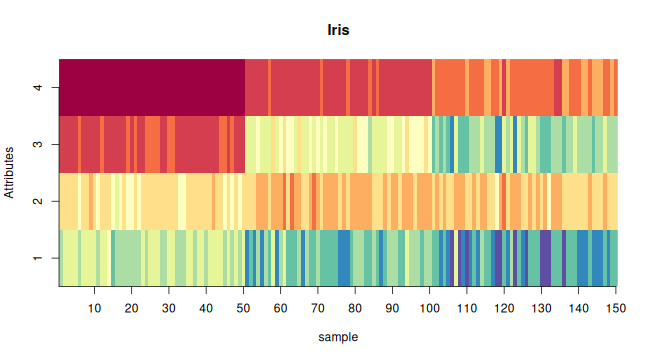

#### Exploratory analysis
A brief exploratory analysis example. 

#### Basic configuration for exploratory analysis


``` r
# basic packages
library(daltoolbox) 
library(RColorBrewer)
library(ggplot2)
library(WVPlots)
library(GGally)  

# choosing colors
colors <- brewer.pal(4, 'Set1')

# setting the font size for all charts
font <- theme(text = element_text(size=16))
```


``` r
# additional packages
{
library(dplyr)
library(reshape)
library(corrplot)
library(WVPlots)
library(GGally)
library(aplpack)
library(daltoolbox)
}
```


``` r
# additional packages
# ============================================================
# Correlation heatmap (publication/dissertation style) with values
# Function: plot_correlation(df, ...)
# - Uses ggplot2 and tidy tools
# - Handles missing values
# - Lets you choose method, triangle, variable selection, ordering, etc.
# ============================================================

plot_correlation <- function(df,
                             vars = NULL,
                             method = c("pearson", "spearman", "kendall"),
                             use = "pairwise.complete.obs",
                             triangle = c("full", "upper", "lower"),
                             reorder = c("none", "hclust", "alphabetical"),
                             digits = 2,
                             label_size = 3,
                             tile_color = "white",
                             show_diag = TRUE,
                             title = NULL) {
  # ---- Dependencies (explicitly) ----
  needed <- c("ggplot2", "dplyr", "tidyr", "tibble")
  missing_pkgs <- needed[!vapply(needed, requireNamespace, logical(1), quietly = TRUE)]
  if (length(missing_pkgs) > 0) {
    stop("Missing packages: ", paste(missing_pkgs, collapse = ", "),
         ". Install with install.packages(c(", paste0('"', missing_pkgs, '"', collapse = ", "), ")).")
  }

  method   <- match.arg(method)
  triangle <- match.arg(triangle)
  reorder  <- match.arg(reorder)

  # ---- Select numeric columns / user vars ----
  if (!is.null(vars)) {
    if (!all(vars %in% names(df))) {
      bad <- vars[!vars %in% names(df)]
      stop("These vars are not in df: ", paste(bad, collapse = ", "))
    }
    df2 <- df[, vars, drop = FALSE]
  } else {
    df2 <- df[, vapply(df, is.numeric, logical(1)), drop = FALSE]
  }

  if (ncol(df2) < 2) {
    stop("Need at least 2 numeric columns to compute correlations.")
  }

  # ---- Correlation matrix ----
  corr <- stats::cor(df2, use = use, method = method)

  # ---- Reorder variables (optional) ----
  var_names <- colnames(corr)

  if (reorder == "alphabetical") {
    ord <- order(var_names)
    corr <- corr[ord, ord, drop = FALSE]
  } else if (reorder == "hclust") {
    # distance based on correlation; robust to small numerical issues
    d <- stats::as.dist(1 - corr)
    hc <- stats::hclust(d, method = "complete")
    ord <- hc$order
    corr <- corr[ord, ord, drop = FALSE]
  }

  # ---- Tidy long format ----
  corr_long <- as.data.frame(corr) |>
    tibble::rownames_to_column("Var1") |>
    tidyr::pivot_longer(-Var1, names_to = "Var2", values_to = "value") |>
    dplyr::mutate(
      Var1 = factor(Var1, levels = rownames(corr)),
      Var2 = factor(Var2, levels = colnames(corr))
    )

  # ---- Filter triangle (optional) ----
  # Use factor indices to compare positions
  corr_long <- corr_long |>
    dplyr::mutate(
      i = as.integer(Var1),
      j = as.integer(Var2)
    )

  if (triangle == "upper") {
    corr_long <- corr_long |>
      dplyr::filter(j > i | (show_diag & j == i))
  } else if (triangle == "lower") {
    corr_long <- corr_long |>
      dplyr::filter(i > j | (show_diag & j == i))
  } else {
    if (!show_diag) corr_long <- corr_long |>
      dplyr::filter(i != j)
  }

  # ---- Labels ----
  corr_long <- corr_long |>
    dplyr::mutate(label = dplyr::if_else(is.na(value), "", format(round(value, digits), nsmall = digits)))

  # ---- Plot ----
  ggplot2::ggplot(corr_long, ggplot2::aes(x = Var1, y = Var2, fill = value)) +
    ggplot2::geom_tile(color = tile_color, linewidth = 0.3) +
    ggplot2::geom_text(ggplot2::aes(label = label), size = label_size) +
    ggplot2::scale_fill_gradient2(
      low = "#4575b4",
      mid = "white",
      high = "#d73027",
      midpoint = 0,
      limits = c(-1, 1),
      oob = scales::squish,
      name = paste0("Corr (", method, ")")
    ) +
    ggplot2::coord_fixed() +
    ggplot2::labs(
      title = title,
      x = NULL,
      y = NULL
    ) +
    ggplot2::theme_minimal(base_size = 12) +
    ggplot2::theme(
      panel.grid = ggplot2::element_blank(),
      axis.text.x = ggplot2::element_text(angle = 45, hjust = 1),
      plot.title = ggplot2::element_text(face = "bold")
    )
}


plot_pair <- function(data, cnames, title = NULL, clabel = NULL, colors) {
  grf <- PairPlot(data, cnames, title, group_var = clabel, palette=NULL) + theme_bw(base_size = 10)
  if (is.null(clabel)) 
    grf <- grf + geom_point(color=colors)
  else
    grf <- grf + scale_color_manual(values=colors) 
  return (grf)
}

plot_pair_adv <- function(data, cnames, title = NULL, clabel= NULL, colors) {
  if (!is.null(clabel)) {
    data$clabel <- data[,clabel]
    cnames <- c(cnames, 'clabel')
  }
  
  icol <- match(cnames, colnames(data))
  icol <- icol[!is.na(icol)]
  
  if (!is.null(clabel)) {
    grf <- ggpairs(data, columns = icol, aes(colour = clabel, alpha = 0.4)) + theme_bw(base_size = 10) 
    
    for(i in 1:grf$nrow) {
      for(j in 1:grf$ncol){
        grf[i,j] <- grf[i,j] + 
          scale_fill_manual(values=colors) +
          scale_color_manual(values=colors)  
      }
    }
  }
  else {
    grf <- ggpairs(data, columns = icol, aes(colour = colors))  + theme_bw(base_size = 10)
  }
  return(grf)
}
```

# ============================================================
# Example usage
# ============================================================

# Example with mtcars (only numeric columns)
p1 <- plot_correlation(mtcars,
                       method = "pearson",
                       triangle = "full",
                       reorder = "hclust",
                       digits = 2,
                       title = "Correlation heatmap (mtcars)")
print(p1)

# Example selecting variables explicitly
p2 <- plot_correlation(mtcars,
                       vars = c("mpg", "disp", "hp", "wt", "qsec"),
                       method = "spearman",
                       triangle = "upper",
                       reorder = "hclust",
                       digits = 2,
                       title = "Spearman correlation (upper triangle)")
print(p2)


#### Iris datasets
The exploratory analysis is done using iris dataset.
There are three basic species


``` r
head(iris[c(1:2,51:52,101:102),])
```

```
##     Sepal.Length Sepal.Width Petal.Length Petal.Width    Species
## 1            5.1         3.5          1.4         0.2     setosa
## 2            4.9         3.0          1.4         0.2     setosa
## 51           7.0         3.2          4.7         1.4 versicolor
## 52           6.4         3.2          4.5         1.5 versicolor
## 101          6.3         3.3          6.0         2.5  virginica
## 102          5.8         2.7          5.1         1.9  virginica
```

#### Data Summary
A preliminary analysis using the $Sepal.Length$ attribute. 

This should be done for all attributes. 


``` r
sum <- summary(iris$Sepal.Length)
sum
```

```
##    Min. 1st Qu.  Median    Mean 3rd Qu.    Max. 
##   4.300   5.100   5.800   5.843   6.400   7.900
```


``` r
IQR <- sum["3rd Qu."]-sum["1st Qu."]
IQR
```

```
## 3rd Qu. 
##     1.3
```

#### Histogram analysis


``` r
grf <- plot_hist(iris |> dplyr::select(Sepal.Length), 
          label_x = "Sepal Length", color=colors[1]) + font
```

```
## Using  as id variables
```

``` r
plot(grf)
```


Grouping graphics


``` r
{
grf1 <- plot_hist(iris |> dplyr::select(Sepal.Length), 
                  label_x = "Sepal.Length", color=colors[1]) + font
grf2 <- plot_hist(iris |> dplyr::select(Sepal.Width), 
                  label_x = "Sepal.Width", color=colors[1]) + font  
grf3 <- plot_hist(iris |> dplyr::select(Petal.Length), 
                  label_x = "Petal.Length", color=colors[1]) + font 
grf4 <- plot_hist(iris |> dplyr::select(Petal.Width), 
                  label_x = "Petal.Width", color=colors[1]) + font
}
```

```
## Using  as id variables
## Using  as id variables
## Using  as id variables
## Using  as id variables
```

``` r
library(gridExtra) 
grid.arrange(grf1, grf2, grf3, grf4, ncol=2)
```


#### Density distribution


``` r
{
grf1 <- plot_density(iris |> dplyr::select(Sepal.Length), 
                  label_x = "Sepal.Length", color=colors[1]) + font
grf2 <- plot_density(iris |> dplyr::select(Sepal.Width), 
                  label_x = "Sepal.Width", color=colors[1]) + font  
grf3 <- plot_density(iris |> dplyr::select(Petal.Length), 
                  label_x = "Petal.Length", color=colors[1]) + font 
grf4 <- plot_density(iris |> dplyr::select(Petal.Width), 
                  label_x = "Petal.Width", color=colors[1]) + font
}
```

```
## Using  as id variables
## Using  as id variables
## Using  as id variables
## Using  as id variables
```

``` r
grid.arrange(grf1, grf2, grf3, grf4, ncol=2)
```


#### Box-plot analysis


``` r
grf <- plot_boxplot(iris, colors=colors[1]) + font
```

```
## Using Species as id variables
```

``` r
plot(grf)
```

```
## Ignoring unknown labels:
## • colour : "c(\"Sepal.Length\", \"Sepal.Width\", \"Petal.Length\", \"Petal.Width\", \"Species\")"
```


#### Consider the classification problem targeting to predict the species

Until previous analysis, the goal of classification problem was not explored. 

#### Density distribution colored by the classifier


``` r
grfA <- plot_density_class(iris |> dplyr::select(Species, Sepal.Length), 
            class_label="Species", label_x = "Sepal.Length", color=colors[c(1:3)]) + font
grfB <- plot_density_class(iris |> dplyr::select(Species, Sepal.Width), 
            class_label="Species", label_x = "Sepal.Width", color=colors[c(1:3)]) + font
grfC <- plot_density_class(iris |> dplyr::select(Species, Petal.Length), 
            class_label="Species", label_x = "Petal.Length", color=colors[c(1:3)]) + font
grfD <- plot_density_class(iris |> dplyr::select(Species, Petal.Width), 
            class_label="Species", label_x = "Petal.Width", color=colors[c(1:3)]) + font

grid.arrange(grfA, grfB, grfC, grfD, ncol=2, nrow=2)
```


#### Box-plot analysis grouped by the classifier


``` r
grfA <- plot_boxplot_class(iris |> dplyr::select(Species, Sepal.Length), 
          class_label="Species", label_x = "Sepal.Length", color=colors[c(1:3)]) + font
grfB <- plot_boxplot_class(iris |> dplyr::select(Species, Sepal.Width), 
          class_label="Species", label_x = "Sepal.Width", color=colors[c(1:3)]) + font
grfC <- plot_boxplot_class(iris |> dplyr::select(Species, Petal.Length), 
          class_label="Species", label_x = "Petal.Length", color=colors[c(1:3)]) + font
grfD <- plot_boxplot_class(iris |> dplyr::select(Species, Petal.Width), 
          class_label="Species", label_x = "Petal.Width", color=colors[c(1:3)]) + font

grid.arrange(grfA, grfB, grfC, grfD, ncol=2, nrow=2)
```

```
## Ignoring unknown labels:
## • colour : "c(\"setosa\", \"versicolor\", \"virginica\")"
## Ignoring unknown labels:
## • colour : "c(\"setosa\", \"versicolor\", \"virginica\")"
## Ignoring unknown labels:
## • colour : "c(\"setosa\", \"versicolor\", \"virginica\")"
## Ignoring unknown labels:
## • colour : "c(\"setosa\", \"versicolor\", \"virginica\")"
```


#### Scatter plot


``` r
grf <- plot_scatter(iris |> dplyr::select(x=Sepal.Length, value=Sepal.Width) |> mutate(variable = "iris"), 
                    label_x = "Sepal.Length") +
  theme(legend.position = "none") + font
plot(grf)
```


``` r
grf <- plot_scatter(iris |> dplyr::select(x = Sepal.Length, value = Sepal.Width, variable = Species), 
                    label_x = "Sepal.Length", label_y = "Sepal.Width", colors=colors[1:3]) + font

plot(grf)
```


#### Correlation matrix


``` r
grf <- plot_correlation(iris |> 
                 dplyr::select(Sepal.Width, Sepal.Length, Petal.Width, Petal.Length))
grf
```


#### Matrix dispersion


``` r
grf <- plot_pair(data=iris, cnames=colnames(iris)[1:4], 
                 title="Iris", colors=colors[1])

plot(grf)
```


#### Matrix dispersion by the classifier


``` r
grf <- plot_pair(data=iris, cnames=colnames(iris)[1:4], 
                 clabel='Species', title="Iris", colors=colors[1:3])
plot(grf)
```


#### Advanced matrix dispersion


``` r
grf <- plot_pair_adv(data=iris, cnames=colnames(iris)[1:4], 
                     title="Iris", colors=colors[1])
grf
```

```
## plot: [1, 1] [=====>-------------------------------------------------------------------------------------------] 6% est: 0s
## plot: [1, 2] [===========>-------------------------------------------------------------------------------------] 12% est: 1s
## plot: [1, 3] [=================>-------------------------------------------------------------------------------] 19% est: 1s
## plot: [1, 4] [=======================>-------------------------------------------------------------------------] 25% est: 1s
## plot: [2, 1] [=============================>-------------------------------------------------------------------] 31% est: 1s
## plot: [2, 2] [===================================>-------------------------------------------------------------] 38% est: 1s
## plot: [2, 3] [=========================================>-------------------------------------------------------] 44% est: 1s
## plot: [2, 4] [===============================================>-------------------------------------------------] 50% est: 1s
## plot: [3, 1] [======================================================>------------------------------------------] 56% est: 1s
## plot: [3, 2] [============================================================>------------------------------------] 62% est: 1s
## plot: [3, 3] [==================================================================>------------------------------] 69% est: 0s
## plot: [3, 4] [========================================================================>------------------------] 75% est: 0s
## plot: [4, 1] [==============================================================================>------------------] 81% est: 0s
## plot: [4, 2] [====================================================================================>------------] 88% est: 0s
## plot: [4, 3] [==========================================================================================>------] 94% est: 0s
## plot: [4, 4] [=================================================================================================]100% est: 0s
```


#### Advanced matrix dispersion with the classifier


``` r
grf <- plot_pair_adv(data=iris, cnames=colnames(iris)[1:4], 
                        title="Iris", clabel='Species', colors=colors[1:3])
grf
```

```
## plot: [1, 1] [===>---------------------------------------------------------------------------------------------] 4% est: 0s
## plot: [1, 2] [=======>-----------------------------------------------------------------------------------------] 8% est: 1s
## plot: [1, 3] [===========>-------------------------------------------------------------------------------------] 12% est: 2s
## plot: [1, 4] [===============>---------------------------------------------------------------------------------] 16% est: 2s
## plot: [1, 5] [==================>------------------------------------------------------------------------------] 20% est: 2s
## plot: [2, 1] [======================>--------------------------------------------------------------------------] 24% est: 2s
## plot: [2, 2] [==========================>----------------------------------------------------------------------] 28% est: 2s
## plot: [2, 3] [==============================>------------------------------------------------------------------] 32% est: 2s
## plot: [2, 4] [==================================>--------------------------------------------------------------] 36% est: 2s
## plot: [2, 5] [======================================>----------------------------------------------------------] 40% est: 1s
## plot: [3, 1] [==========================================>------------------------------------------------------] 44% est: 1s
## plot: [3, 2] [==============================================>--------------------------------------------------] 48% est: 1s
## plot: [3, 3] [=================================================>-----------------------------------------------] 52% est: 1s
## plot: [3, 4] [=====================================================>-------------------------------------------] 56% est: 1s
## plot: [3, 5] [=========================================================>---------------------------------------] 60% est: 1s
## plot: [4, 1] [=============================================================>-----------------------------------] 64% est: 1s
## plot: [4, 2] [=================================================================>-------------------------------] 68% est: 1s
## plot: [4, 3] [=====================================================================>---------------------------] 72% est: 1s
## plot: [4, 4] [=========================================================================>-----------------------] 76% est: 1s
## plot: [4, 5] [=============================================================================>-------------------] 80% est: 1s
## plot: [5, 1] [================================================================================>----------------] 84% est: 0s
## `stat_bin()` using `bins = 30`. Pick better value `binwidth`.
 plot: [5, 2]
## [====================================================================================>------------] 88% est: 0s `stat_bin()`
## using `bins = 30`. Pick better value `binwidth`.
 plot: [5, 3]
## [========================================================================================>--------] 92% est: 0s `stat_bin()`
## using `bins = 30`. Pick better value `binwidth`.
 plot: [5, 4]
## [============================================================================================>----] 96% est: 0s `stat_bin()`
## using `bins = 30`. Pick better value `binwidth`.
 plot: [5, 5]
## [=================================================================================================]100% est: 0s
```


#### Parallel coordinates


``` r
grf <- ggparcoord(data = iris, columns = c(1:4), group=5) + 
    theme_bw(base_size = 10) + scale_color_manual(values=colors[1:3]) + font

plot(grf)
```


#### Images


``` r
mat <- as.matrix(iris[,1:4])
x <- (1:nrow(mat))
y <- (1:ncol(mat))

image(x, y, mat, col = brewer.pal(11, 'Spectral'), axes = FALSE,  
      main = "Iris", xlab="sample", ylab="Attributes")
axis(2, at = seq(0, ncol(mat), by = 1))
axis(1, at = seq(0, nrow(mat), by = 10))
```



#### Chernoff faces


``` r
set.seed(1)
sample_rows = sample(1:nrow(iris), 25)

isample = iris[sample_rows,]
labels = as.character(rownames(isample))
isample$Species <- NULL

faces(isample, labels = labels, print.info=F, cex=1)
```


#### Chernoff faces with the classifier


``` r
set.seed(1)
sample_rows = sample(1:nrow(iris), 25)

isample = iris[sample_rows,]
labels = as.character(isample$Species)
isample$Species <- NULL

faces(isample, labels = labels, print.info=F, cex=1)
```


