#### Exploratory analysis
A brief exploratory analysis example. 

#### Basic configuration for exploratory analysis


``` r
# basic packages
library(daltoolbox) 
library(RColorBrewer)
library(ggplot2)

# choosing colors
colors <- brewer.pal(4, 'Set1')

# setting the font size for all charts
font <- theme(text = element_text(size=16))
```


``` r
# additional packages
{
library(dplyr)
library(reshape)
library(corrplot)
library(WVPlots)
library(GGally)
library(aplpack)
}
```

```
## 
## Anexando pacote: 'reshape'
```

```
## O seguinte objeto é mascarado por 'package:dplyr':
## 
##     rename
```

```
## corrplot 0.95 loaded
```

```
## Carregando pacotes exigidos: wrapr
```

```
## 
## Anexando pacote: 'wrapr'
```

```
## O seguinte objeto é mascarado por 'package:dplyr':
## 
##     coalesce
```

```
## Registered S3 method overwritten by 'GGally':
##   method from   
##   +.gg   ggplot2
```

```
## Error in library(aplpack): não há nenhum pacote chamado 'aplpack'
```

``` r
source("https://raw.githubusercontent.com/eogasawara/datamining/refs/heads/main/4-ExploratoryAnalysis.R")
```

```
## Warning in file(filename, "r", encoding = encoding): cannot open URL
## 'https://raw.githubusercontent.com/eogasawara/datamining/refs/heads/main/4-ExploratoryAnalysis.R': HTTP status was '404 Not Found'
```

```
## Error in file(filename, "r", encoding = encoding): cannot open the connection to 'https://raw.githubusercontent.com/eogasawara/datamining/refs/heads/main/4-ExploratoryAnalysis.R'
```

#### Iris datasets
The exploratory analysis is done using iris dataset.
There are three basic species


``` r
head(iris[c(1:2,51:52,101:102),])
```

```
##     Sepal.Length Sepal.Width Petal.Length Petal.Width    Species
## 1            5.1         3.5          1.4         0.2     setosa
## 2            4.9         3.0          1.4         0.2     setosa
## 51           7.0         3.2          4.7         1.4 versicolor
## 52           6.4         3.2          4.5         1.5 versicolor
## 101          6.3         3.3          6.0         2.5  virginica
## 102          5.8         2.7          5.1         1.9  virginica
```

#### Data Summary
A preliminary analysis using the $Sepal.Length$ attribute. 

This should be done for all attributes. 


``` r
sum <- summary(iris$Sepal.Length)
sum
```

```
##    Min. 1st Qu.  Median    Mean 3rd Qu.    Max. 
##   4.300   5.100   5.800   5.843   6.400   7.900
```


``` r
IQR <- sum["3rd Qu."]-sum["1st Qu."]
IQR
```

```
## 3rd Qu. 
##     1.3
```

#### Histogram analysis


``` r
grf <- plot_hist(iris |> dplyr::select(Sepal.Length), 
          label_x = "Sepal Length", color=colors[1]) + font
```

```
## Using  as id variables
```

``` r
plot(grf)
```

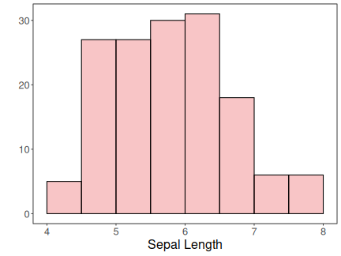

Grouping graphics


``` r
{
grf1 <- plot_hist(iris |> dplyr::select(Sepal.Length), 
                  label_x = "Sepal.Length", color=colors[1]) + font
grf2 <- plot_hist(iris |> dplyr::select(Sepal.Width), 
                  label_x = "Sepal.Width", color=colors[1]) + font  
grf3 <- plot_hist(iris |> dplyr::select(Petal.Length), 
                  label_x = "Petal.Length", color=colors[1]) + font 
grf4 <- plot_hist(iris |> dplyr::select(Petal.Width), 
                  label_x = "Petal.Width", color=colors[1]) + font
}
```

```
## Using  as id variables
## Using  as id variables
## Using  as id variables
## Using  as id variables
```

``` r
library(gridExtra) 
grid.arrange(grf1, grf2, grf3, grf4, ncol=2)
```

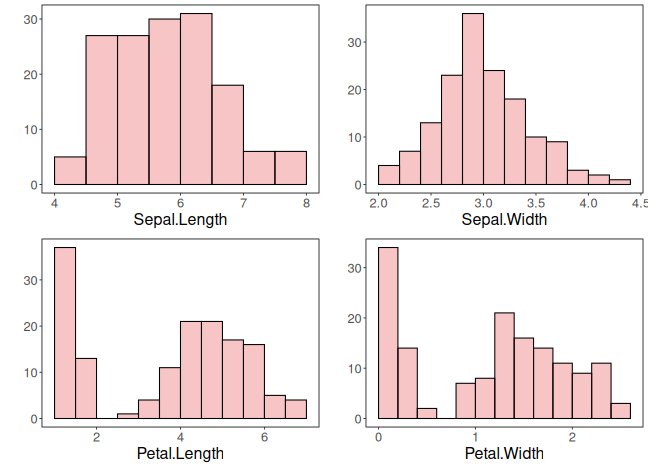

#### Density distribution


``` r
{
grf1 <- plot_density(iris |> dplyr::select(Sepal.Length), 
                  label_x = "Sepal.Length", color=colors[1]) + font
grf2 <- plot_density(iris |> dplyr::select(Sepal.Width), 
                  label_x = "Sepal.Width", color=colors[1]) + font  
grf3 <- plot_density(iris |> dplyr::select(Petal.Length), 
                  label_x = "Petal.Length", color=colors[1]) + font 
grf4 <- plot_density(iris |> dplyr::select(Petal.Width), 
                  label_x = "Petal.Width", color=colors[1]) + font
}
```

```
## Using  as id variables
## Using  as id variables
## Using  as id variables
## Using  as id variables
```

``` r
grid.arrange(grf1, grf2, grf3, grf4, ncol=2)
```

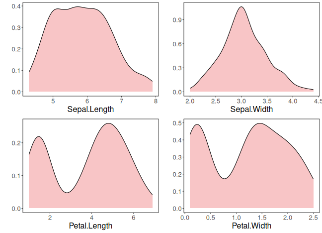

#### Box-plot analysis


``` r
grf <- plot_boxplot(iris, colors=colors[1]) + font
```

```
## Using Species as id variables
```

``` r
plot(grf)
```

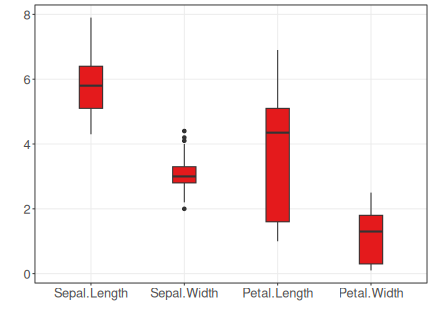

#### Consider the classification problem targeting to predict the species

Until previous analysis, the goal of classification problem was not explored. 

#### Density distribution colored by the classifier


``` r
grfA <- plot_density_class(iris |> dplyr::select(Species, Sepal.Length), 
            class_label="Species", label_x = "Sepal.Length", color=colors[c(1:3)]) + font
grfB <- plot_density_class(iris |> dplyr::select(Species, Sepal.Width), 
            class_label="Species", label_x = "Sepal.Width", color=colors[c(1:3)]) + font
grfC <- plot_density_class(iris |> dplyr::select(Species, Petal.Length), 
            class_label="Species", label_x = "Petal.Length", color=colors[c(1:3)]) + font
grfD <- plot_density_class(iris |> dplyr::select(Species, Petal.Width), 
            class_label="Species", label_x = "Petal.Width", color=colors[c(1:3)]) + font

grid.arrange(grfA, grfB, grfC, grfD, ncol=2, nrow=2)
```

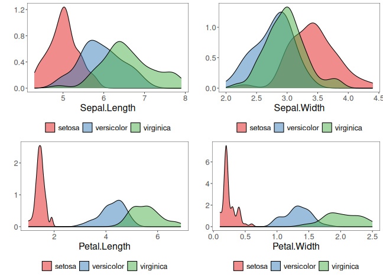

#### Box-plot analysis grouped by the classifier


``` r
grfA <- plot_boxplot_class(iris |> dplyr::select(Species, Sepal.Length), 
          class_label="Species", label_x = "Sepal.Length", color=colors[c(1:3)]) + font
grfB <- plot_boxplot_class(iris |> dplyr::select(Species, Sepal.Width), 
          class_label="Species", label_x = "Sepal.Width", color=colors[c(1:3)]) + font
grfC <- plot_boxplot_class(iris |> dplyr::select(Species, Petal.Length), 
          class_label="Species", label_x = "Petal.Length", color=colors[c(1:3)]) + font
grfD <- plot_boxplot_class(iris |> dplyr::select(Species, Petal.Width), 
          class_label="Species", label_x = "Petal.Width", color=colors[c(1:3)]) + font

grid.arrange(grfA, grfB, grfC, grfD, ncol=2, nrow=2)
```

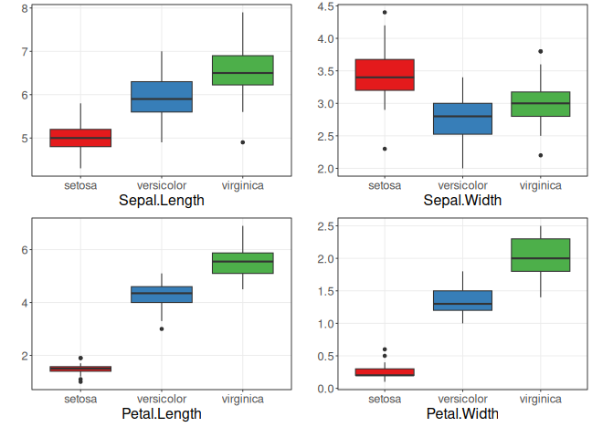

#### Scatter plot


``` r
grf <- plot_scatter(iris |> dplyr::select(x=Sepal.Length, value=Sepal.Width) |> mutate(variable = "iris"), 
                    label_x = "Sepal.Length") +
  theme(legend.position = "none") + font
plot(grf)
```

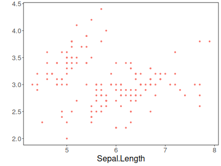


``` r
grf <- plot_scatter(iris |> dplyr::select(x = Sepal.Length, value = Sepal.Width, variable = Species), 
                    label_x = "Sepal.Length", label_y = "Sepal.Width", colors=colors[1:3]) + font

plot(grf)
```

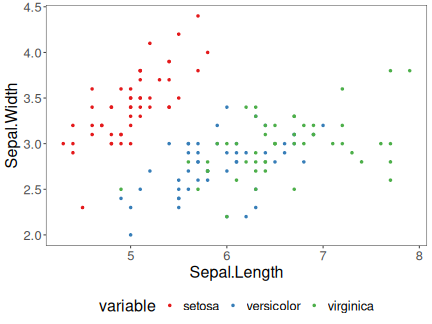

#### Correlation matrix


``` r
grf <- plot_correlation(iris |> 
                 dplyr::select(Sepal.Width, Sepal.Length, Petal.Width, Petal.Length))
```

```
## Error in plot_correlation(dplyr::select(iris, Sepal.Width, Sepal.Length, : não foi possível encontrar a função "plot_correlation"
```

``` r
grf
```

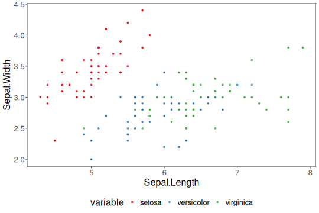

#### Matrix dispersion


``` r
grf <- plot_pair(data=iris, cnames=colnames(iris)[1:4], 
                 title="Iris", colors=colors[1])
```

```
## Error in plot_pair(data = iris, cnames = colnames(iris)[1:4], title = "Iris", : não foi possível encontrar a função "plot_pair"
```

``` r
plot(grf)
```


#### Matrix dispersion by the classifier


``` r
grf <- plot_pair(data=iris, cnames=colnames(iris)[1:4], 
                 clabel='Species', title="Iris", colors=colors[1:3])
```

```
## Error in plot_pair(data = iris, cnames = colnames(iris)[1:4], clabel = "Species", : não foi possível encontrar a função "plot_pair"
```

``` r
plot(grf)
```

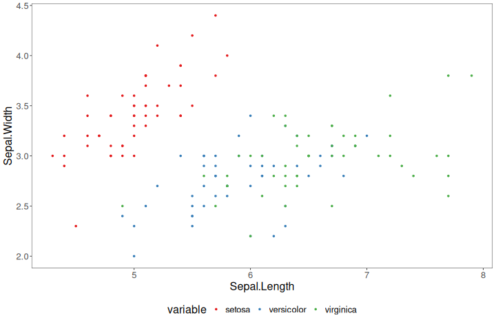

#### Advanced matrix dispersion


``` r
grf <- plot_pair_adv(data=iris, cnames=colnames(iris)[1:4], 
                     title="Iris", colors=colors[1])
```

```
## Error in plot_pair_adv(data = iris, cnames = colnames(iris)[1:4], title = "Iris", : não foi possível encontrar a função "plot_pair_adv"
```

``` r
grf
```


#### Advanced matrix dispersion with the classifier


``` r
grf <- plot_pair_adv(data=iris, cnames=colnames(iris)[1:4], 
                        title="Iris", clabel='Species', colors=colors[1:3])
```

```
## Error in plot_pair_adv(data = iris, cnames = colnames(iris)[1:4], title = "Iris", : não foi possível encontrar a função "plot_pair_adv"
```

``` r
grf
```

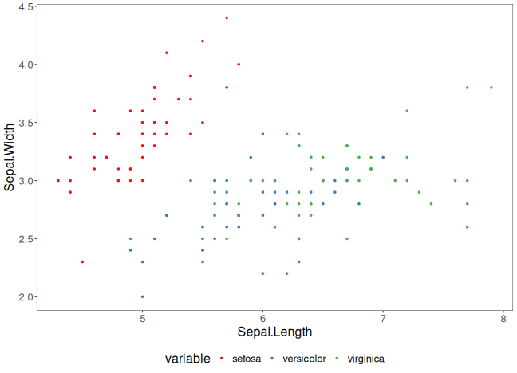

#### Parallel coordinates


``` r
grf <- ggparcoord(data = iris, columns = c(1:4), group=5) + 
    theme_bw(base_size = 10) + scale_color_manual(values=colors[1:3]) + font

plot(grf)
```

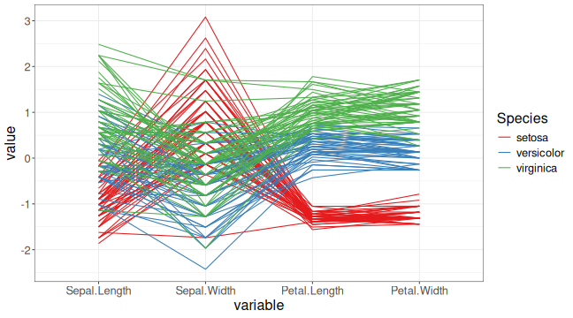

#### Images


``` r
mat <- as.matrix(iris[,1:4])
x <- (1:nrow(mat))
y <- (1:ncol(mat))

image(x, y, mat, col = brewer.pal(11, 'Spectral'), axes = FALSE,  
      main = "Iris", xlab="sample", ylab="Attributes")
axis(2, at = seq(0, ncol(mat), by = 1))
axis(1, at = seq(0, nrow(mat), by = 10))
```

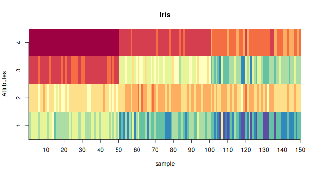

#### Chernoff faces


``` r
set.seed(1)
sample_rows = sample(1:nrow(iris), 25)

isample = iris[sample_rows,]
labels = as.character(rownames(isample))
isample$Species <- NULL

faces(isample, labels = labels, print.info=F, cex=1)
```

```
## Error in faces(isample, labels = labels, print.info = F, cex = 1): não foi possível encontrar a função "faces"
```

#### Chernoff faces with the classifier


``` r
set.seed(1)
sample_rows = sample(1:nrow(iris), 25)

isample = iris[sample_rows,]
labels = as.character(isample$Species)
isample$Species <- NULL

faces(isample, labels = labels, print.info=F, cex=1)
```

```
## Error in faces(isample, labels = labels, print.info = F, cex = 1): não foi possível encontrar a função "faces"
```

