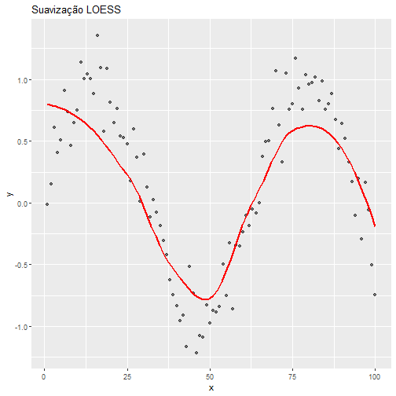
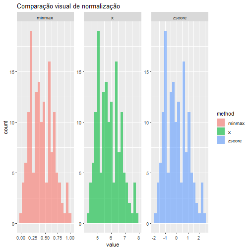

# Pré-processamento de Dados

Este roteiro reúne exemplos do DALToolbox e de bibliotecas amplamente usadas, alinhados aos slides de `3-Preprocessamento.pdf`.  
Cada chunk indica o **slide** correspondente.

## Configuração


``` r
# Slides 1–3: panorama do pré-processamento
require_pkg <- function(pkg) {
  if (!requireNamespace(pkg, quietly = TRUE)) {
    stop(sprintf("Pacote '%s' não instalado. Instale com install.packages('%s').", pkg, pkg))
  }
  invisible(TRUE)
}

pkgs <- c("daltoolbox","dplyr","tidyr","ggplot2","caret","scales")
invisible(lapply(pkgs, require_pkg))

suppressPackageStartupMessages({
  library(daltoolbox)
  library(dplyr)
  library(tidyr)
  library(ggplot2)
  library(caret)
  library(scales)
})
```

## Limpeza de dados


``` r
# Slide 6: Como lidar com dados ausentes (remoção)
iris <- datasets::iris
iris.na <- iris
iris.na$Sepal.Length[2] <- NA
iris.na.omit <- na.omit(iris.na)
head(iris.na.omit)
```

```
##   Sepal.Length Sepal.Width Petal.Length Petal.Width Species
## 1          5.1         3.5          1.4         0.2  setosa
## 3          4.7         3.2          1.3         0.2  setosa
## 4          4.6         3.1          1.5         0.2  setosa
## 5          5.0         3.6          1.4         0.2  setosa
## 6          5.4         3.9          1.7         0.4  setosa
## 7          4.6         3.4          1.4         0.3  setosa
```


``` r
# Slide 6: Imputação simples (média/mediana)
iris_na <- iris
iris_na$Sepal.Length[c(2, 10, 25)] <- NA
iris_imputed <- iris_na %>%
  mutate(
    Sepal.Length = if_else(
      is.na(Sepal.Length),
      median(Sepal.Length, na.rm = TRUE),
      Sepal.Length
    )
  )
summary(iris_imputed$Sepal.Length)
```

```
##    Min. 1st Qu.  Median    Mean 3rd Qu.    Max. 
##   4.300   5.125   5.800   5.862   6.400   7.900
```


``` r
# Slide 10: Remoção de outliers (boxplot)
out_obj <- outliers_boxplot()
out_obj <- fit(out_obj, iris)
iris.clean <- transform(out_obj, iris)
head(iris.clean)
```

```
##   Sepal.Length Sepal.Width Petal.Length Petal.Width Species
## 1          5.1         3.5          1.4         0.2  setosa
## 2          4.9         3.0          1.4         0.2  setosa
## 3          4.7         3.2          1.3         0.2  setosa
## 4          4.6         3.1          1.5         0.2  setosa
## 5          5.0         3.6          1.4         0.2  setosa
## 6          5.4         3.9          1.7         0.4  setosa
```


``` r
# Slide 8–10: Remoção de outliers (regra 3σ)
out_obj <- outliers_gaussian()
out_obj <- fit(out_obj, iris)
iris.clean <- transform(out_obj, iris)
head(iris.clean)
```

```
##   Sepal.Length Sepal.Width Petal.Length Petal.Width Species
## 1          5.1         3.5          1.4         0.2  setosa
## 2          4.9         3.0          1.4         0.2  setosa
## 3          4.7         3.2          1.3         0.2  setosa
## 4          4.6         3.1          1.5         0.2  setosa
## 5          5.0         3.6          1.4         0.2  setosa
## 6          5.4         3.9          1.7         0.4  setosa
```


``` r
# Slide 8: Suavização por regressão (LOESS)
set.seed(123)
x <- seq(1, 100)
y <- sin(x / 10) + rnorm(100, sd = 0.2)
dat <- data.frame(x, y)
ggplot(dat, aes(x, y)) +
  geom_point(alpha = 0.5) +
  geom_smooth(method = "loess", se = FALSE, color = "red") +
  labs(title = "Suavização LOESS", x = "x", y = "y")
```

```
## `geom_smooth()` using formula = 'y ~ x'
```



## Redução e representação


``` r
# Slides 20–22: PCA
iris <- datasets::iris
mypca <- dt_pca("Species")
mypca <- fit(mypca, datasets::iris)
iris.pca <- transform(mypca, iris)
head(iris.pca)
```

```
##        PC1       PC2 Species
## 1 2.640270 -5.204041  setosa
## 2 2.670730 -4.666910  setosa
## 3 2.454606 -4.773636  setosa
## 4 2.545517 -4.648463  setosa
## 5 2.561228 -5.258629  setosa
## 6 2.975946 -5.707321  setosa
```


``` r
# Slides 23–24: Seleção de atributos (correlação alta)
num_iris <- iris[, vapply(iris, is.numeric, logical(1)), drop = FALSE]
cor_mat <- cor(num_iris)
high_corr <- caret::findCorrelation(cor_mat, cutoff = 0.9)
colnames(num_iris)[high_corr]
```

```
## [1] "Petal.Length"
```


``` r
# Slide 26: Geração de features
iris_feat <- iris %>%
  mutate(
    Sepal.Area = Sepal.Length * Sepal.Width,
    Petal.Area = Petal.Length * Petal.Width,
    Sepal.Ratio = Sepal.Length / Sepal.Width
  )
head(iris_feat)
```

```
##   Sepal.Length Sepal.Width Petal.Length Petal.Width Species Sepal.Area Petal.Area Sepal.Ratio
## 1          5.1         3.5          1.4         0.2  setosa      17.85       0.28    1.457143
## 2          4.9         3.0          1.4         0.2  setosa      14.70       0.28    1.633333
## 3          4.7         3.2          1.3         0.2  setosa      15.04       0.26    1.468750
## 4          4.6         3.1          1.5         0.2  setosa      14.26       0.30    1.483871
## 5          5.0         3.6          1.4         0.2  setosa      18.00       0.28    1.388889
## 6          5.4         3.9          1.7         0.4  setosa      21.06       0.68    1.384615
```


``` r
# Slide 27: Agregação de dados
iris %>%
  group_by(Species) %>%
  summarise(
    mean_sepal = mean(Sepal.Length),
    sd_sepal = sd(Sepal.Length),
    n = n()
  )
```

```
## # A tibble: 3 × 4
##   Species    mean_sepal sd_sepal     n
##   <fct>           <dbl>    <dbl> <int>
## 1 setosa           5.01    0.352    50
## 2 versicolor       5.94    0.516    50
## 3 virginica        6.59    0.636    50
```

## Transformação e normalização


``` r
# Slide 29: Normalização Min-Max
norm <- minmax()
norm <- fit(norm, iris)
ndata <- transform(norm, iris)
summary(ndata)
```

```
##   Sepal.Length     Sepal.Width      Petal.Length     Petal.Width            Species  
##  Min.   :0.0000   Min.   :0.0000   Min.   :0.0000   Min.   :0.00000   setosa    :50  
##  1st Qu.:0.2222   1st Qu.:0.3333   1st Qu.:0.1017   1st Qu.:0.08333   versicolor:50  
##  Median :0.4167   Median :0.4167   Median :0.5678   Median :0.50000   virginica :50  
##  Mean   :0.4287   Mean   :0.4406   Mean   :0.4675   Mean   :0.45806                  
##  3rd Qu.:0.5833   3rd Qu.:0.5417   3rd Qu.:0.6949   3rd Qu.:0.70833                  
##  Max.   :1.0000   Max.   :1.0000   Max.   :1.0000   Max.   :1.00000
```


``` r
# Slide 29: Normalização Z-Score
norm <- zscore()
norm <- fit(norm, iris)
ndata <- transform(norm, iris)
summary(ndata)
```

```
##   Sepal.Length       Sepal.Width       Petal.Length      Petal.Width            Species  
##  Min.   :-1.86378   Min.   :-2.4258   Min.   :-1.5623   Min.   :-1.4422   setosa    :50  
##  1st Qu.:-0.89767   1st Qu.:-0.5904   1st Qu.:-1.2225   1st Qu.:-1.1799   versicolor:50  
##  Median :-0.05233   Median :-0.1315   Median : 0.3354   Median : 0.1321   virginica :50  
##  Mean   : 0.00000   Mean   : 0.0000   Mean   : 0.0000   Mean   : 0.0000                  
##  3rd Qu.: 0.67225   3rd Qu.: 0.5567   3rd Qu.: 0.7602   3rd Qu.: 0.7880                  
##  Max.   : 2.48370   Max.   : 3.0805   Max.   : 1.7799   Max.   : 1.7064
```


``` r
# Slide 30: Comparação visual de normalização
vals <- data.frame(
  x = iris$Sepal.Length,
  minmax = scales::rescale(iris$Sepal.Length),
  zscore = as.numeric(scale(iris$Sepal.Length))
)

vals_long <- vals %>%
  pivot_longer(cols = c(x, minmax, zscore), names_to = "method", values_to = "value")

ggplot(vals_long, aes(value, fill = method)) +
  geom_histogram(bins = 20, alpha = 0.6, position = "identity") +
  facet_wrap(~ method, scales = "free") +
  labs(title = "Comparação visual de normalização")
```



## Discretização e suavização


``` r
# Slides 33–35: Binning por intervalos
obj <- smoothing_inter(n = 2)
obj <- fit(obj, iris$Sepal.Length)
sl.bi <- transform(obj, iris$Sepal.Length)
table(sl.bi)
```

```
## sl.bi
## 5.32842105263158 6.73272727272727 
##               95               55
```


``` r
# Slides 33–35: Binning por frequência (quantis)
obj <- smoothing_freq(n = 2)
obj <- fit(obj, iris$Sepal.Length)
sl.bi <- transform(obj, iris$Sepal.Length)
table(sl.bi)
```

```
## sl.bi
## 5.19875    6.58 
##      80      70
```


``` r
# Slide 35: Discretização via clustering
obj <- smoothing_cluster(n = 2)
obj <- fit(obj, iris$Sepal.Length)
sl.bi <- transform(obj, iris$Sepal.Length)
table(sl.bi)
```

```
## sl.bi
## 5.19875    6.58 
##      80      70
```

## Hierarquias e mapeamento categórico


``` r
# Slides 38–39: Mapeamento categórico (one-hot)
cm <- categ_mapping("Species")
iris_cm <- transform(cm, iris)
head(iris_cm)
```

```
##   Speciessetosa Speciesversicolor Speciesvirginica
## 1             1                 0                0
## 2             1                 0                0
## 3             1                 0                0
## 4             1                 0                0
## 5             1                 0                0
## 6             1                 0                0
```


``` r
# Slides 36–37: Hierarquia de conceitos (exemplo simples)
iris %>%
  mutate(
    Sepal.Length.Level = cut(
      Sepal.Length,
      breaks = c(-Inf, 5.5, 6.5, Inf),
      labels = c("baixo", "medio", "alto")
    )
  ) %>%
  count(Sepal.Length.Level)
```

```
##   Sepal.Length.Level  n
## 1              baixo 59
## 2              medio 61
## 3               alto 30
```

## Amostragem e balanceamento


``` r
# Slides 40–41: Amostragem aleatória
tt <- train_test(sample_random(), iris)
table(tt$train$Species)
```

```
## 
##     setosa versicolor  virginica 
##         39         37         44
```


``` r
# Slides 41–43: Amostragem estratificada
tt <- train_test(sample_stratified("Species"), iris)
table(tt$train$Species)
```

```
## 
##     setosa versicolor  virginica 
##         40         40         40
```


``` r
# Slide 42: Amostragem com e sem reposição
set.seed(123)
srswor <- sample(iris$Sepal.Length, size = 10, replace = FALSE)
srswr <- sample(iris$Sepal.Length, size = 10, replace = TRUE)
srswor
```

```
##  [1] 4.3 5.0 7.7 4.4 5.9 6.5 5.5 5.5 5.8 6.1
```

``` r
srswr
```

```
##  [1] 6.3 5.1 6.1 5.0 4.6 6.3 6.7 5.5 4.4 7.1
```


``` r
# Slide 43: Amostragem por cluster (exemplo simples)
set.seed(123)
clusters <- split(iris, iris$Species)
sampled_clusters <- sample(names(clusters), 2)
cluster_sample <- bind_rows(clusters[sampled_clusters])
table(cluster_sample$Species)
```

```
## 
##     setosa versicolor  virginica 
##         50          0         50
```


``` r
# Slides 45–46: Balanceamento de classes (up/down sampling)
set.seed(123)
iris_imb <- iris %>% filter(Species != "setosa")
iris_imb$Species <- droplevels(iris_imb$Species)

# Garantir data.frame puro para compatibilidade com versões antigas
iris_x <- iris_imb[, setdiff(names(iris_imb), "Species"), drop = FALSE]
down <- downSample(x = iris_x, y = iris_imb$Species)
table(down$Class)
```

```
## 
## versicolor  virginica 
##         50         50
```

``` r
up <- upSample(x = iris_x, y = iris_imb$Species)
table(up$Class)
```

```
## 
## versicolor  virginica 
##         50         50
```

## Referências
- Han, J., Kamber, M., Pei, J. (2011). *Data Mining: Concepts and Techniques*.
- García, S., Luengo, J., Herrera, F. (2014). *Data Preprocessing in Data Mining*.
- Little, R. J. A., Rubin, D. B. (2002). *Statistical Analysis with Missing Data*.
- Tukey, J. W. (1977). *Exploratory Data Analysis*.
- Satopaa, V. et al. (2011). Finding a “Kneedle” in a Haystack. *ICDCS*.
